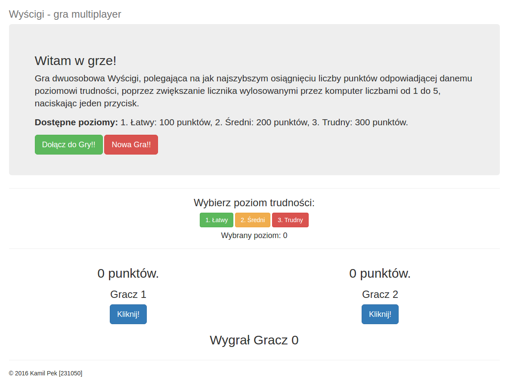

# Techniki Internetowe - 2015/2016
## MeteorJS, MongoDB i Bootstrap

- Autor: Kamil Pek - 231050

## Wyścigi
Gra dwuosobowa Wyścigi, polegająca na jak najszybszym osiągnięciu liczby punktów odpowiadjącej danemu poziomowi trudności, poprzez zwiększanie licznika wylosowanymi przez komputer liczbami od 1 do 10, naciskając jeden przycisk.
Dostępne poziomy: 1. Łatwy: 100 punktów, 2. Średni: 200 punktów, 3. Trudny: 300 punktów.

